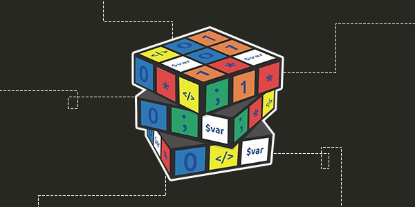

## Roteiro do curso 101

### introdução
Como fazer sistema web com pouca informação e consultar suas necessidades

### 1: Revisão lógica primitiva de programação python 3

- tipos: `int string obj`
- Condição `if`
- Loop: `for`
- Função/Método: `def xxx():`
- Futuro classes `class xxx:` e Programação orientada a objeto
- Atributos de classes

### 2: Meu primeiro Site

- Flask
- Explicação de Rotas e Anotation
- Site "Hello word"
- Renderizando template
- Log

### 3: Templatização

- HTML
- CSS
- JS "Hello world"
- Bootstrap
- Templates flask

### 4: Salvando meu código versionado com git

- Funcionamento `git`
- Commits
- Branches

### 5: Lançando na núvem

- O que é um deploy
- Heroku e criação de conta
- Configuração para lançamento
- Deploy na cloud

### Conclusão

- Acessando aplicação da cloud
- Programador treinee completo
- Experiencia com Python, Flask, front-end, JS, Web, git, Heroku.  

### Estudos futuros
- Banco de dados (BD)
- SQL
- Integração SQLite com flask
- Crud com dados na app
- Implementação de uma solução com BD na app
