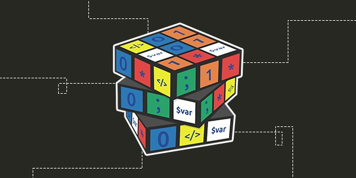
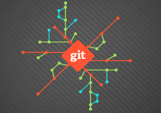

## Roteiro do curso 101
    "Não decore, entenda" - Ivan B. Guerra

Se decorar logo esquecerá, se você entendeu nunca vai esquecer tudo.

### Introdução
 Como fazer sistema web direto ao ponto com flask e python e pouca informação consultando suas necessidades.

### 1: Revisão lógica primitiva de programação python 3

- tipos: `int string obj`
- Condição `if`
- Loop: `for`
- Função/Método: `def xxx():`
- Futuro classes `class xxx:` e Programação orientada a objeto
- Variáveis/Atributos

### 2: Meu primeiro Site

- Flask
- Explicação de Rotas e Anotation
- Site "Hello word"
- Renderizando template
- Log

### 3: Templatização

- HTML
- CSS
- JavaScript "Hello world" (JS)
- Bootstrap
- Templates flask

### 4: Salvando meu código versionado com git

- Funcionamento `git`
- Commits
- Branches

### 5: Lançando na núvem

- O que é um deploy
- Heroku e criação de conta
- Configuração para lançamento
- Deploy na cloud
- Acessando aplicação da cloud

### Conclusão

- Programador treinee completo
- Experiencia com Python 3, Flask, Front-End, JavaScript, Web, git, Heroku.  

### Estudos futuros

- Banco de dados (BD)
- SQL
- Integração SQLite com flask
- Crud com dados na app
- Implementação de uma solução com BD na app

### Extra

- Markdown
